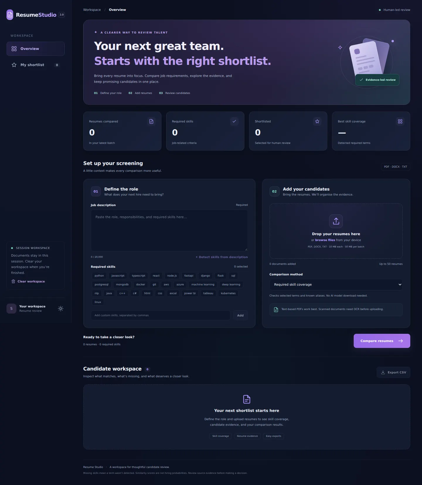

# Resume Studio 2.0

A React + FastAPI replacement for the original Streamlit resume-screening application. Streamlit has been removed completely. This source project runs locally; no hosting provider is required or selected.



## Included

- Responsive midnight/violet UI with light theme toggle and mobile navigation.
- PDF, DOCX, TXT uploads with drag-and-drop, removal and size checks.
- Required-skill chips, custom terms and detection from the job description.
- Ranked candidate cards, table view, filename search and coverage filters.
- Native accessible evidence dialog with extracted text, matched and missing skills.
- Session shortlist and formula-protected CSV exports without full resume text.
- FastAPI validation, duplicate handling, per-file issues and in-memory processing.
- Optional semantic comparison with sentence-transformers, cached model and chunked text.

## Requirements

Python 3.10+ and Node.js 20.19+ (or 22.12+). Clone this repository and open two terminals in its root folder (the folder containing `backend` and `frontend`).

### Terminal 1 — backend (Windows PowerShell)

```powershell
cd backend
py -m venv .venv
.\.venv\Scripts\python.exe -m pip install -r requirements.txt
.\.venv\Scripts\python.exe -m uvicorn main:app --reload --port 8000
```

### Terminal 2 — frontend

```powershell
cd frontend
npm ci
npm run dev
```

Open http://localhost:5173. API docs: http://localhost:8000/docs.

Using the virtual environment's Python directly avoids PowerShell activation-policy issues. If `py` is unavailable, use `python` to create the environment.

### macOS / Linux backend

```bash
cd backend
python3 -m venv .venv
.venv/bin/python -m pip install -r requirements.txt
.venv/bin/python -m uvicorn main:app --reload --port 8000
```

The frontend commands are the same as on Windows.

## Optional semantic mode

Skills-only screening is fully functional with the base requirements. To enable semantic text comparison, stop the backend, install the optional requirements, then restart it:

```powershell
cd backend
.\.venv\Scripts\python.exe -m pip install -r requirements-semantic.txt
```

First use downloads `sentence-transformers/all-MiniLM-L6-v2`. It requires internet and more memory. The model is reused across requests. Resume and job texts are split into 160-word chunks; for each job chunk, the best matching resume chunk is found, then scores are averaged. The displayed percentage is scaled cosine similarity, not hiring probability. Skill coverage is shown separately. If semantic mode is unavailable, a visible message explains the skills-only fallback.

## Tests and build

```powershell
cd backend
.\.venv\Scripts\python.exe -m pip install -r requirements-dev.txt
.\.venv\Scripts\python.exe -m unittest discover -s tests -v
```

```powershell
cd frontend
npm test
npm run build
```

`frontend/dist` is generated by the build. It is deliberately excluded from the source ZIP and Git. The included package-lock.json fixes the frontend installation for npm ci.

## Project structure

- `backend/main.py`: API routes, upload validation, screening and optional embedding scores.
- `backend/screening.py`: PDF/DOCX/TXT extraction, skill boundaries, aliases and chunking.
- `backend/tests/`: core and API tests, including a generated PDF.
- `frontend/src/App.jsx`: workspace, inputs, results, shortlist, evidence dialog.
- `frontend/src/styles.css`: responsive dark/light design system.
- `frontend/src/utils.js`: upload checks and CSV formatting/export.
- `frontend/vite.config.js`: local proxy to the backend.
- `previews/`: dashboard preview captured during browser verification.

## Environment settings for later

The local frontend proxies `/api` to port 8000. For separate hosting, set `VITE_API_URL` to the backend origin before building. Set backend `FRONTEND_ORIGINS` to the allowed frontend origin(s), comma-separated. These are documented in the .env.example files; backend .env files are not automatically loaded. Deployment is left for later.

## Limits and review scope

Uploads: 50 files, 10 MB each, 50 MB total; job description: 20,000 characters; resume text: 200,000 characters. Scanned PDFs need external OCR. Custom skills are matched literally; known skills support aliases. A detected term does not establish proficiency, and missing terms can reflect paraphrasing.

Documents and results are not saved to a database. The backend reads uploads in memory; the multipart parser can spool incoming uploads temporarily, then closes them after processing. Results and shortlist live in React state and disappear on refresh or Clear workspace. Clearing during a request cancels the browser wait; server work already started may finish. Google Fonts is optional and has a system-font fallback.

This version supports human review. It has no authentication, persistent applicant database, automatic rejection workflow or public-production access controls. Optional semantic model loading is not exercised by the base automated tests. Authentication and hosting-level request limits should be considered when preparing a public deployment.

## Verified for this release

Production frontend build, frontend utility checks, and all 12 backend/core tests passed. Browser verification covered real upload requests, skill detection, candidate ranking, evidence dialog, shortlist, CSV download, table view, theme switch, and a 390px mobile viewport with no horizontal overflow or browser errors. Optional model download/inference remains untested. Preview candidates are synthetic test resumes.

## Single-service deployment

The included Dockerfile builds React and serves it alongside FastAPI on one origin. `render.yaml` configures a Render web service with the free plan and `/api/health` health check. Import this repository as a Render Blueprint to create it. A hosting account and successful deployment are required before a live URL exists.

The default container enables skills-only screening; optional semantic dependencies are not installed. Selecting semantic mode displays the existing fallback message. To enable embeddings later, use a suitable compute plan and install requirements-semantic.txt in the container.

Local container commands:

```bash
docker build -t resume-studio .
docker run --rm -p 8000:8000 resume-studio
```

Then open http://localhost:8000. Production uses `web:app`; local two-terminal development continues to use `main:app` and Vite.

## Vercel deployment

Import this repository with its root directory set to the repository root. vercel.json builds frontend/ and routes /api requests to api/index.py. Base Python dependencies support skills-only screening; semantic mode keeps its explicit fallback. Vercel builds set a 4 MB total upload limit in the UI, and the backend checks request/result content size. Local and Docker runs retain the larger limits. Hosting deployment must still be verified after connecting an account.
